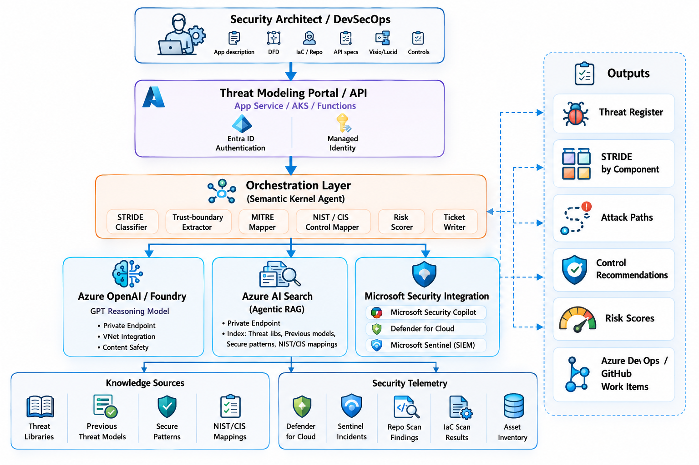

# .NET OpenAI Threat Modeler MVP

A runnable ASP.NET Core minimal API for automated security threat modeling. The solution uses an OpenAI chat-client analyzer by default, with Azure OpenAI and mock analyzers available through the same workflow and factory abstractions.

## Solution architecture



The architecture in `docs/ThreatModelerAIV1.png` shows the long-term platform shape:

- Security architects and DevSecOps teams submit app descriptions, DFD context, infrastructure/repo details, diagrams, known controls, and other analysis context.
- The Threat Modeling Portal/API receives the request and runs under Azure hosting options such as App Service, AKS, or Functions with Entra ID authentication and managed identity.
- The orchestration layer coordinates specialized capabilities such as STRIDE classification, trust-boundary extraction, MITRE mapping, NIST/CIS control mapping, risk scoring, and ticket writing.
- Azure OpenAI/Foundry, Azure AI Search, and Microsoft Security integrations enrich the analysis with reasoning, retrieval, telemetry, prior threat models, secure patterns, asset inventory, and security findings.
- Outputs include a threat register, STRIDE by component, attack paths, control recommendations, risk scores, and Azure DevOps/GitHub work items.

This repository implements the API and orchestration core of that architecture. The current default path is OpenAI-backed analysis, while preserving extension points for Azure OpenAI, AI Search, Cosmos DB, and ticket/security integrations.

## Design approach

The refactor follows the pattern references under `DotNet/Patterns` in `dondeetan/best-practices-poc`:

- **Strategy pattern**: `IAnalyzer` allows `ChatClientAnalyzer` and `MockAnalyzer` to be swapped without changing workflow code.
- **Factory Method pattern**: `AnalyzerFactory` selects the configured analyzer. `openai` is the default.
- **Facade pattern**: `SubmissionWorkflow` gives the API one application-service entry point for submit, analyze, and result retrieval.
- **Repository pattern**: `ISubmissionStore` hides in-memory and future Cosmos DB persistence.
- **Proxy pattern**: `CosmosSubmissionStore` preserves the Cosmos-facing repository contract until the live SDK implementation is added.
- **SOLID principles**: workflow orchestration, analyzer selection, persistence, and endpoint composition are separated so each type has a focused reason to change.

The code includes short comments at the implementation points where these patterns or principles are applied.

## What this repo includes

- ASP.NET Core API with endpoints:
  - `POST /submit`
  - `POST /analyze/{submissionId}`
  - `GET /results/{runId}`
  - `GET /health`
- Chat-client analyzer support for OpenAI and Azure OpenAI
- Analyzer factory for OpenAI, Azure OpenAI, and mock analyzers
- Cosmos DB repository scaffold with in-memory local store
- Tests for workflow, store behavior, mock analyzer behavior, and analyzer selection

## Repository structure

```text
dotnet-ai-threat-modeler/
+-- README.md
+-- .env.example
+-- AiThreatModeler.sln
+-- src/
|   +-- Api/
|   |   +-- Program.cs
|   |   +-- appsettings.json
|   |   +-- appsettings.Development.json
|   |   \-- Api.csproj
|   +-- ThreatModeler/
|   |   +-- Configuration/
|   |   +-- Models/
|   |   \-- Services/
|   \-- ThreatModeler.Tests/
+-- docs/
|   +-- ThreatModelerAIV1.png
|   \-- cosmos-schema.md
\-- cosmos/
    \-- schema-examples.json
```

## Local development prerequisites

- .NET 10 SDK
- Optional future integrations:
  - Azure Cosmos DB account
  - Azure OpenAI or Azure AI Foundry deployment

## Quick start

### 1. Restore packages

```bash
dotnet restore
```

### 2. Configure settings

Use `src/Api/appsettings.Development.json` or environment variables.

Recommended local defaults:

```json
{
  "App": {
    "AnalyzerType": "openai",
    "UseInMemoryStore": true
  }
}
```

Supported analyzer types:

- `openai`
- `azure-openai`
- `mock`

When `AnalyzerType` is `openai`, configure the `OpenAI` section with `Endpoint`, `ApiKey`, and `Model`.
When `AnalyzerType` is `azure-openai`, configure the `AzureOpenAI` section with `Endpoint`, `ApiKey`, and `Model`.

### 3. Run locally

```bash
dotnet run --project src/Api
```

The API starts on the ASP.NET Core assigned local port, commonly `http://localhost:5099`.

## Example flow

### Submit

```bash
curl -X POST http://localhost:5099/submit \
  -H "Content-Type: application/json" \
  -d '{
    "tenantId": "tenant-demo",
    "applicationName": "Claims API",
    "businessPurpose": "Processes insurance claims",
    "architectureSummary": "React SPA -> API Management -> App Service -> Azure SQL",
    "components": ["React SPA", "API Management", "App Service", "Azure SQL"],
    "dataFlows": ["Browser to SPA", "SPA to API Management", "App Service to Azure SQL"],
    "trustBoundaries": ["Internet to Azure Edge", "Application Tier to Data Tier"],
    "openAiDocument": "{\"modelContext\":\"Claims API exposes read and write operations for insurance claims.\"}",
    "authenticationDetails": "Entra ID for users, Managed Identity for service-to-service",
    "sensitiveData": ["PII", "financial data"],
    "internetExposure": "Public SPA and API entrypoint",
    "existingControls": ["WAF", "Key Vault", "Defender for Cloud"],
    "assumptions": ["No public access to SQL"]
  }'
```

### Analyze

```bash
curl -X POST "http://localhost:5099/analyze/<submissionId>?tenantId=tenant-demo"
```

### Results

```bash
curl "http://localhost:5099/results/<runId>?tenantId=tenant-demo"
```

## Integration notes

- OpenAI is the default analyzer and can produce threat-model output from the submitted application context.
- Azure OpenAI uses the shared `ChatClientShared` factory and can be selected with `App:AnalyzerType`.
- Cosmos DB remains behind `ISubmissionStore`; switch `UseInMemoryStore=false` only after adding the live Cosmos SDK implementation.
